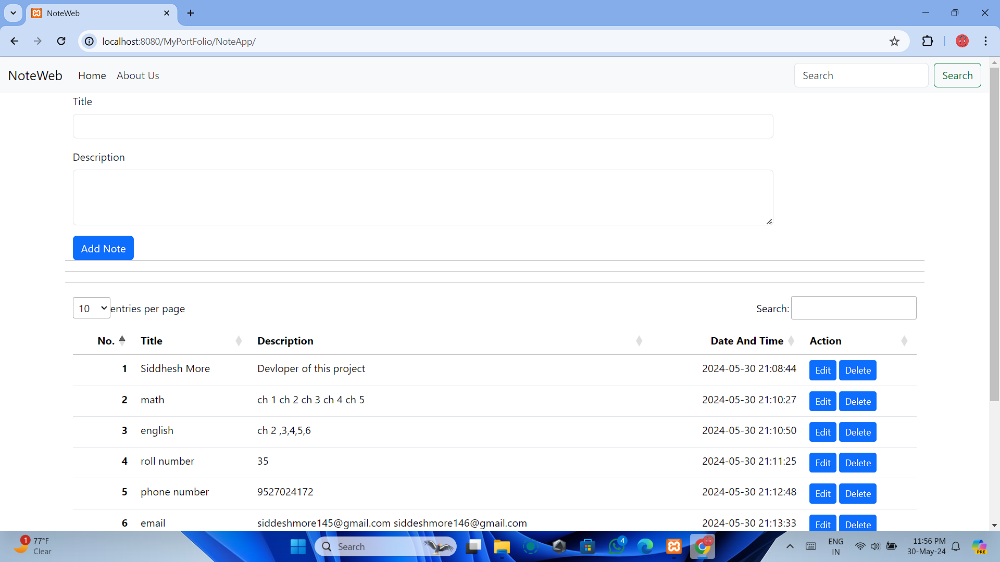
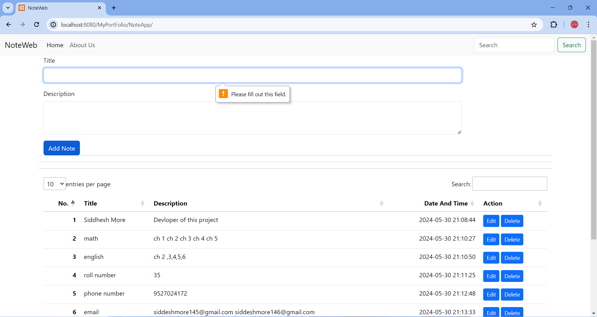
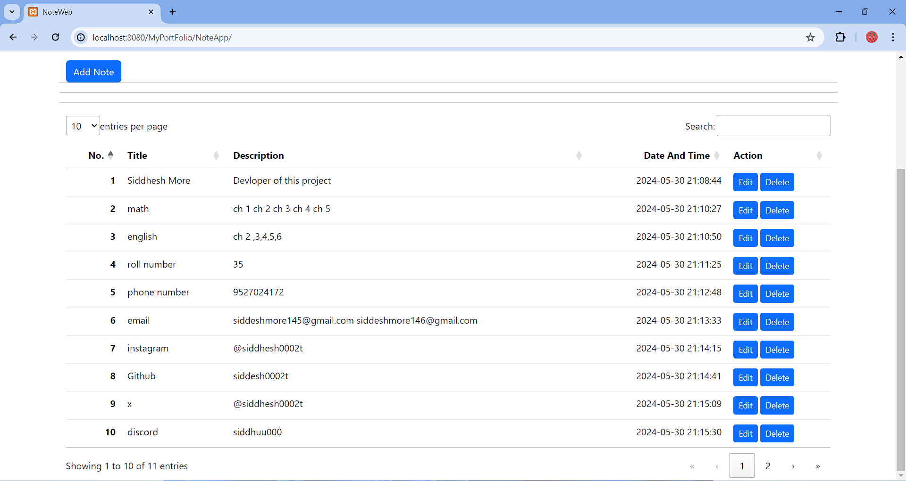
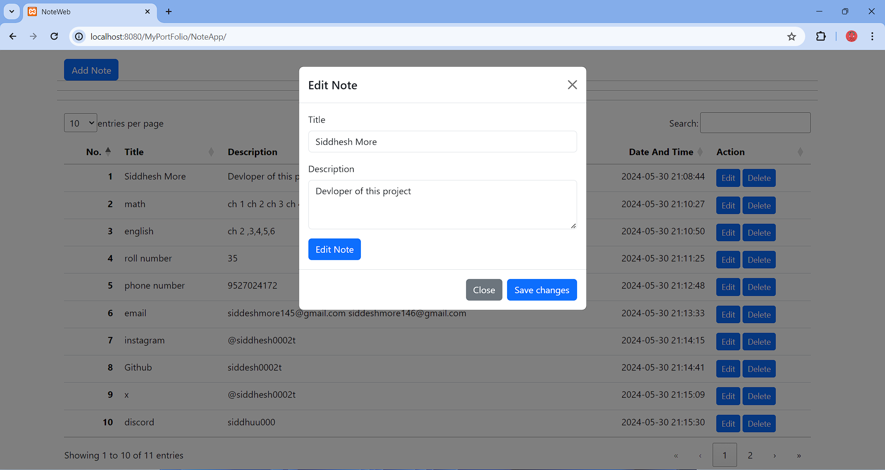
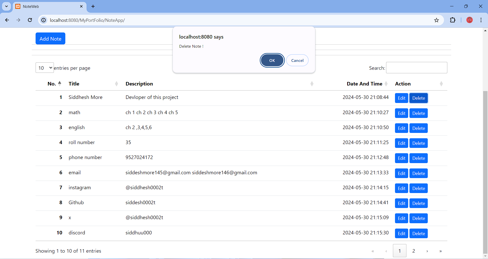
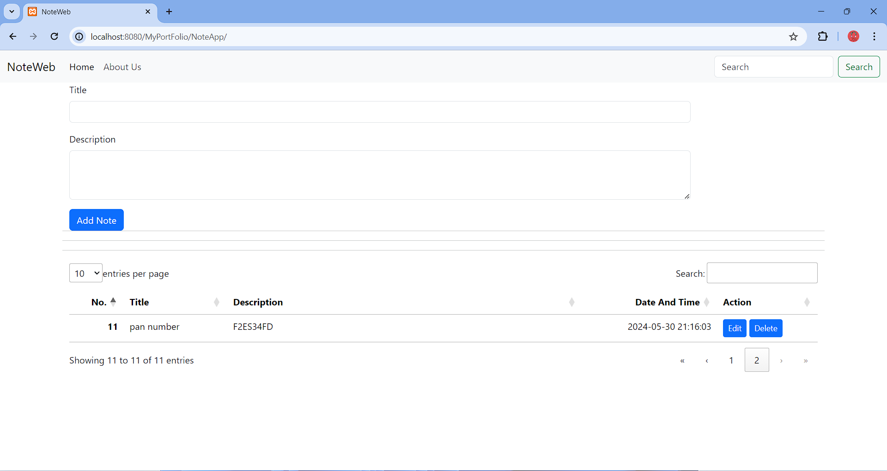
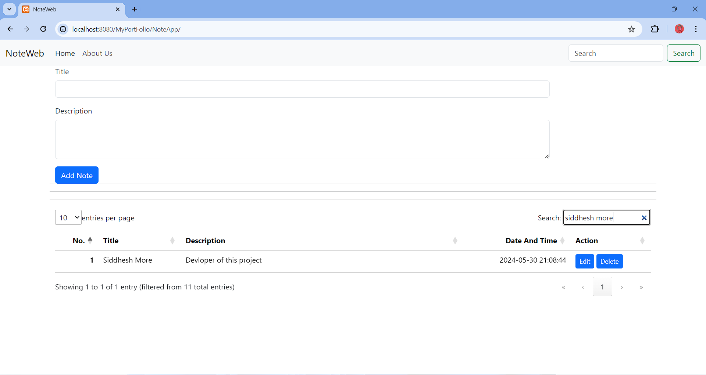
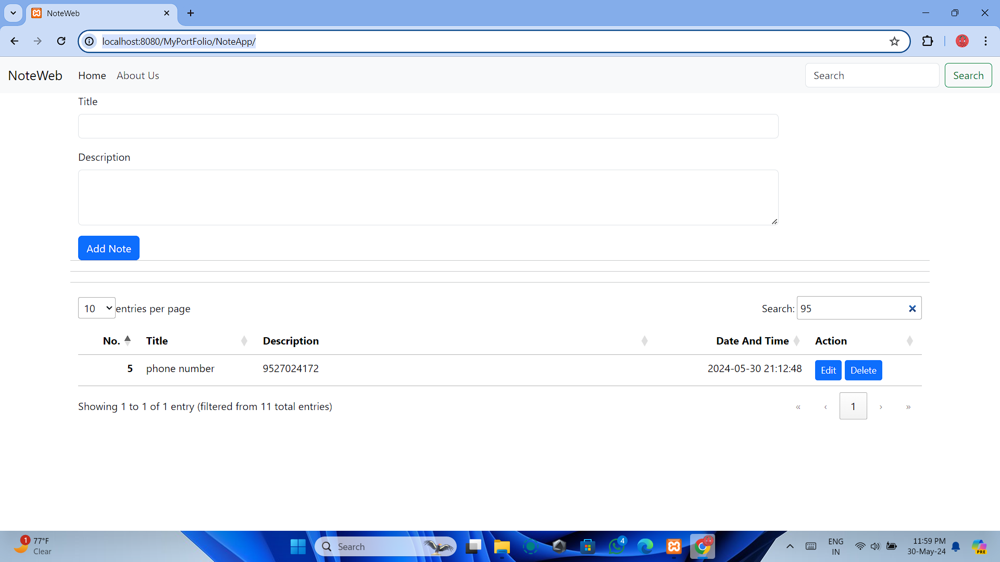

# NoteApp
This repository contains the code for a simple note-taking web application called NoteApp. The application allows users to add, edit, and delete notes. The code is written in PHP and uses MySQL as the database. The front-end is built using Bootstrap.
A simple note-taking web application built with PHP, MySQL, and Bootstrap.

## Table of Contents
* [Screenshots](#screenshots)
* [Installation](#installation)
* [Usage](#usage)
* [Features](#features)
* [License](#license)
## Screenshots
--------------

Here are some screenshots of the application:

## Installation

To install NoteWeb, follow these steps:

1. Clone the repository: `git clone https://github.com/yourusername/noteweb.git`
2. Create a new MySQL database and import the `notes.sql` file.
3. Run the application by navigating to `http://localhost/NoteApp` in your web browser.

## Usage

To use NoteApp, simply navigate to the application URL and start creating notes! You can add, edit, and delete notes using the intuitive interface.

## Features

* Create, edit, and delete notes
* Search notes by title or description
* Sort notes by date and time
* Responsive design using Bootstrap

## License

NoteWeb is licensed under the MIT License. See the `LICENSE` file for details.
